# Identity Decision Brief

## Decision State

The identity program is ready for the owner's held-out candidate, but it is not
ready to select or apply a final name. The search corpus, assessment protocol,
scenario policy, and adversarial review are fixed at commits `221a508` and
`7d75b0e`; `selection_made` remains `false`.

Three conclusions support that state:

1. The explored identity space is broad and reproducible enough for a blind
   comparison. More generation is unlikely to change the major semantic or
   morphological territories.
2. The score frontier is informative but not decisive. It favors ScopeTree and
   Draftifact across the declared futures, while the hostile audit shows that a
   strong technical metaphor or category descriptor may still be the wrong
   master brand.
3. Model judgment cannot clear the remaining human gates. Speech recovery,
   accessibility, audience connotation, language and community review, and
   legal clearance remain owner-visible requirements for any finalist.

## What The Results Say

The current frontier separates by identity role rather than producing one
universal winner.

| Role or future | Current leaders | Interpretation |
| --- | --- | --- |
| Elixir library | ScopeTree, Faultcell, Draftifact | Strong technical fit; umbrella durability is unresolved |
| Research framework | ScopeTree, Draftifact, Afterstate | Reproducibility and transformation language performs well |
| Artifact-optimization platform | Draftifact, ScopeTree, Afterstate | Draftifact expresses the broader horizon most directly |
| Commercial developer product | Draftifact, ScopeTree, Trialbook | Product legibility improves, but clearance and speech evidence are absent |
| Company or institutional umbrella | Draftifact, ScopeTree, Trialbook | No candidate reaches Tier A; this is the weakest claimed role |
| Cross-runtime protocol | ScopeTree, Draftifact, Programmatics | Technical/system language dominates again |

ScopeTree ranks first for the Elixir library, research framework, and protocol
views. Draftifact ranks first for the platform, commercial product, and company
views. That symmetry is useful evidence of an architectural choice, not proof
that either should name everything.

The likely identity architecture is layered:

- a memorable master brand;
- a plain category descriptor;
- explicit names for the library, research effort, protocol, and future
  products where they should not share one word; and
- code forms that preserve the intended spoken and written identity.

## Evidence Behind The Conclusion

| Evidence layer | Completed scale |
| --- | ---: |
| Product constitution | 33 territories, 19 audiences, 14 lexical strategies, 14 brand architectures, 18 axes |
| Independent search | 36 portfolios across 8 waves |
| Raw candidate observations | 2,310 |
| Normalized candidate entities | 2,052 |
| Independent model assessments | 6,156, or 3 per entity |
| Declared future projections | 6 |
| Wildcard candidates retained | 439 |
| Package registry checks | 8,208 current checks |
| Active exact-collision flags | 1,682 across 667 candidates |
| Dissent and reinterpretation events | 22 |

Model rank agreement is substantial enough for navigation: scenario pairwise
Spearman correlations range from 0.692 to 0.743, and consistency ICC for the
three-profile mean ranges from 0.891 to 0.903. Absolute agreement for a single
profile is much weaker because the providers use different score scales.
Accordingly, the system uses equal-profile means, preserves disagreement, and
does not treat score distance as calibrated measurement.

## How The System Reached It

```mermaid
flowchart LR
  A[Product constitution] --> B[36 isolated search portfolios]
  B --> C[Lossless registry]
  C --> D[Speech, code, prose, and architecture embodiments]
  D --> E[Registry and international screens]
  E --> F[Three independent model assessments]
  F --> G[Six role-specific projections]
  G --> H[Dissent, wildcard, saturation, and hostile review]
  H --> I[Frozen blind-comparison baseline]
  I --> J[Owner-held-out candidate]
  J --> K[Role-aware comparison, no automatic selection]
```

Raw observations and additive evidence are the durable source material.
Rankings, tiers, Pareto sets, and review pools are replaceable projections. The
system never deletes a candidate and never converts a model score into a final
decision.

## Next Checkpoint

The next input is the owner's candidate with its intended spelling,
pronunciation, rationale, and plausible role. It must enter through an isolated
held-out overlay and receive the same enrichment, exact package checks, three
profile assessments, scenario projections, disagreement analysis, and human
gate inventory as the frozen corpus.

The resulting comparison must report ranks, tiers, Pareto membership, factual
flags, code projections, role interpretations, and unresolved gates. It must
not tune the criteria around the candidate, silently narrow the existing
frontier, select a winner, or start the repository rename.

## Supporting Detail

- [`system-map.md`](system-map.md) describes the complete process and data
  lineage.
- [`hostile-audit.md`](hostile-audit.md) records the strongest objections and
  required human gates.
- [`review-pools.json`](review-pools.json) contains the reproducible scenario,
  wildcard, Pareto, disagreement, flag, and resurrection views.
- [`inter-rater-reliability.json`](inter-rater-reliability.json) contains the
  model agreement and scale-bias diagnostics.
