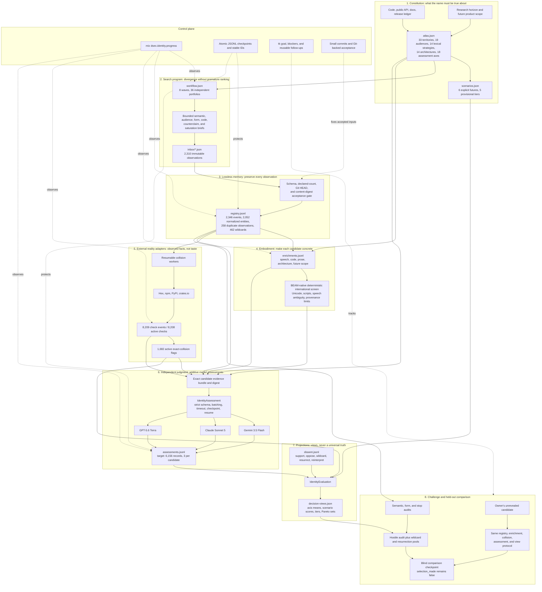

# Identity System Map

The identity work is a small evidence-and-decision system. It does not treat a
name as an isolated string. A name is a compact public theory of the product
and a set of interfaces across speech, code, documentation, communities,
package registries, and possible future products.

The system is designed to answer four different questions without collapsing
them into one:

1. What is the product actually allowed to claim?
2. What is the full identity space worth considering?
3. What evidence and disagreement attach to each candidate?
4. What does a candidate look like under different explicit futures?

It intentionally does not answer the later owner decision by itself.

## Whole System

## Natural Abstractions

### Constitution

The atlas is the constitution. It records the product boundary, audiences,
semantic territories, identity architectures, lexical mechanisms, hazards,
and assessment axes before a favorite can bend the criteria around itself.
Scenario weights are visible policy choices, not hidden truth.

### Search Program

The workflow is a search program. Independent portfolios explore different
parts of the space without seeing leaders from earlier runs. Later waves attack
coverage gaps and then test saturation. Completion means that new challenge
waves stop adding material semantic or morphological territory, not that an
arbitrary name count has been reached.

### Lossless Memory

The registry is an event log. All 2,310 observations remain, including weak
ideas, repeated names, collisions, and malformed intuitions that passed the raw
portfolio contract. Normalization identifies 2,052 candidate entities without
erasing the 258 duplicate observations or their independent provenance.

### Embodiment

Enrichment turns an abstraction into things people can inspect: a spoken
recommendation, support-call phrase, Hex package, OTP application, module root,
Mix task, configuration prefix, telemetry prefix, README headline, paper title,
conference sentence, error message, company, protocol, and product family.

This is where a candidate stops being a pleasing word and starts behaving like
a real identity.

### Reality Adapters

Collision checks and the deterministic international screen attach observed or
bounded evidence without converting facts into taste. The package audit has
8,209 append-only events representing 8,208 current source-candidate checks and
1,682 candidates with at least one exact registry collision.

All 2,052 enrichments have an international screen. At least one dimension is
explicitly unverified for every candidate, 1,556 require machine-detected
attention, and zero claim human cultural, accessibility, native-speaker, or
legal validation.

### Independent Juries

Three model profiles assess the same evidence independently across all 18
axes. The runner rejects unknown candidates, missing axes, invalid scores,
invented evidence references, malformed structured output, and incomplete
batches. Successful records are append-only and resumable by exact profile,
atlas, and evidence digests.

These are model judgments, not user research. Different models are useful here
because disagreement is information rather than an error to average away.

### Projection Engine

The evaluator turns the same underlying score vectors into six declared
futures: an Elixir library, research framework, artifact-optimization platform,
commercial developer product, company umbrella, and protocol ecosystem. It
publishes scenario ranks, provisional tiers, and Pareto frontiers while keeping
flags and dissent separate from preference scores.

The projections are lenses over the corpus. They never delete a candidate and
they never set `selection_made` to true.

### Constitutional Challenge

Saturation audits challenge whether the search was broad enough. The hostile
audit challenges whether the views are robust, whether model confidence scales
distort the aggregate, whether a high-scoring candidate carries an ignored
claim, and whether an unpopular candidate deserves resurrection.

### Blind Holdout

The owner's unrevealed candidate functions like a held-out test case. It enters
only after the corpus and decision protocol are fixed, then traverses the same
registry, embodiment, collision, assessment, and projection path. This tests
the process without letting the process tune itself around the expected answer.

## Data Created

| Artifact | Role | Current scale |
| --- | --- | ---: |
| `atlas.json` | Product and identity constitution | 33 territories, 19 audiences, 14 strategies, 14 architectures, 18 axes |
| `workflow.json` | Declared search and completion denominator | 8 waves, 36 portfolios, 2,310 observations |
| `inbox/*.json` | Immutable raw generation portfolios | 36 files, 2,310 observations |
| `registry.jsonl` | Lossless occurrence and entity event log | 2,346 events, 2,052 entities |
| `enrichments.jsonl` | Speech, code, prose, architecture, and international embodiments | 2,052 records |
| `research/package-collision-checks.jsonl` | Append-only external registry observations | 8,209 events, 8,208 active checks |
| `research/package-collision-flags.jsonl` | Candidate-linked exact collision facts | 1,682 active flags |
| `assessments.jsonl` | Three independent evidence-bounded judgments per entity | 6,156 records at checkpoint completion |
| `assessment-runs.jsonl` | Starts, successes, failures, retries, and model provenance | Consolidated after provider completion |
| `scenarios.json` | Visible decision policy | 6 scenarios, 5 tiers |
| `reports/*.json` and `reports/*.md` | Reproducible projections and audits | Coverage, saturation, decision, hostile, and integrity reports |

The large corpus is intentional. Reports are derived and replaceable; raw
portfolios, registry events, assessment events, flags, and dissent remain the
source material.

## What Is Reusable

Reuse is high in the mechanics, medium in the domain model, and intentionally
low in the project-specific corpus.

### Reusable now

- Stable IDs, supersession, append-only JSONL records, and atomic checkpoints.
- Git-backed acceptance and progress accounting over declared work.
- Resumable, provider-neutral, schema-validated assessment batches.
- Exact evidence digests and strict evidence-reference validation.
- Registry collision adapters with durable retries and terminal states.
- Deterministic Unicode, script, code-projection, and speech-attention checks.
- Confidence-aware axis aggregation, explicit scenario weights, tiers, and
  Pareto views.
- Separate fact, judgment, dissent, and report layers.

### Reusable by configuration

- The atlas, workflow, portfolio, enrichment, assessment, flag, and dissent
  schemas form a general identity-census method.
- Product boundaries, audiences, territories, architectures, assessment axes,
  scenario weights, and package sources can be replaced for another project.
- The embodiment grammar can be adapted to another language ecosystem while
  preserving the same evidence flow.

### Specific to this identity decision

- The current product boundary and future horizon.
- The 36 generation briefs and 2,310 raw observations.
- Candidate rationales, code forms, collision facts, assessments, and dissent.
- The six current scenario weightings and the eventual owner comparison.

### Extraction work already tracked

- `de-c6vu`, provider-neutral resumable batch execution, is complete.
- `de-55fz` tracks general append-only artifact integrity.
- `de-9ohp` tracks reusable race-proof Git snapshot progress.
- `de-503w` tracks stronger reusable Unicode confusable screening.
- `de-8k3b` tracks idempotent enrichment rebuilds.

The result is not a naming oracle. It is a reusable way to search broadly,
remember honestly, attach evidence, expose assumptions, and make a consequential
identity choice without pretending uncertainty has disappeared.
